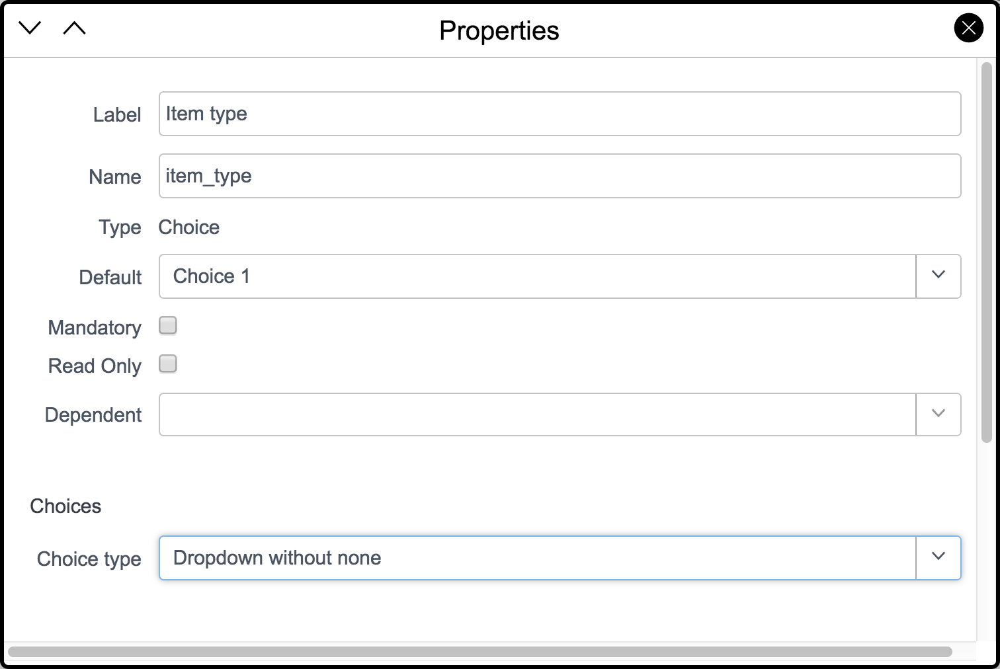

# Goal

Replace a spreadsheet based process and create a Servicenow application to manage temporary loaner assets like laptops, mobile phones, projectors from multiple locations.

Currently, the IT department in your organization is using a spreadsheet to track temporary loaner assets. However, the organization is rapidly outgrowing that solution as they open additional offices domestically and globally. The spreadsheet does not scale well to the organization's needs.

As the IT Service Manager, you are intersting in building a loaner item application accessible to all users via an online portal with automated workflow to route work and notifications.

In this section you will create a new application, define the data model used to contain your information, configure the user interface to align with your process, import the legacy data from a spreadsheet, and explore other base system capabilities to make your process more streamline.

*Note: This use case may not be applicable in your organization. However any manual type process with a list of requests and a simple conditional workflow will work with this demonstration flow.*

# Prerequisites

Before beginning the lab, please ensure you have a dedicated Now Platform instance on the London release available.

If you have not already acquired a developer instance on the Now Platform, the process is simple and free.

To acquire a free Now Platform instance follow the steps below. 

1. Please register yourself on the [ServiceNow Developer Portal](https://developer.servicenow.com).

    

1. Click the **Program** tab to learn more about the ServiceNow Developer Program.

1. Click the **Manage** tab to request your instance. The developer instance is completely cloud based and does not need to download additional tooling. If you have your credentials received by email, you are good to go! You must be logged in to the ServiceNow Developers Portal for the **Manage** tab to appear.

1. Download the [Loaner Requestss Excel Spreadsheet](files/Loaner-Requests.xlsx). If the file does not download automatically, click the **Download** button on the form.

    

<!-- Section 1 # Build Your First App -->

# Create the Application

The objective of this lab is to create the application framework used in the following exercises. You will use the ServiceNow Studio development environment (IDE) to create and manage the various files of your application.

1. Begin by logging in to your instance with the credentials provided.

    

1. Once logged in, go to the application navigator filter, and then type *studio*. Click **System Applications > Studio**.

    

1. From the Load Application dialog, click **Create Application**.

    

1. Click **Create** for the **Create custom application** option.

    

1. In the **Name** field, type *Loaner* as the name of the application. The remaining fields are populated automatically. There is no need to change the values.

    
   
    Note the **Scope** uses the application namespace identifier format "x\_[Vendor prefix]_[Application ID]". Vendor prefix is a two to five charactter code generated by ServiceNow for each customer. Therefore, this value might be different for your instance.

1. Click **Create**.

    

1. When asked to confirm, click **OK**.

    

1. In the Application Creation dialog, click **Back to list**.

    

1. In the list of applications, click **Loaner**.

    

Congratulations, you successfully created your first ServiceNow application! Now it's time to configure it for your loaner process.

---

# Create the Data Model

In this lab exercise, you will create a table to store the loaner request records previously maintained in a spreadsheet.

1. From within Studio, in the upper left click **Create Application File**.

    

1. In the Create Application File dialog, from the left column select **Data Model** (1). From the middle column select **Table** (2), and then click **Create** (3).

    

1. Complete the following fields with the values identified below. *Note: Fields not listed can be left with default values.*

    |Field|Value|
    |-----|-----|
    |Label|*Request*|
    |Extends table|*Task*|

    
    
    By extending the Task table, you accelerate the application development time. Task provides dozens of available fields, a default form and list layout, and basic business logic for managing assignable work (a task).

1. Go to the **Controls** section of the form, and then select the **Auto-number** field.

1. In the **Prefix** field, type *LNR*.

    

1. Click **Submit**.

    

Congratulations, you created a table!

---

# Tidy up the Form Design and List Layout

The table is created, but the loaner request form does not fit the requirements needed to manage the intended process.

In this exercise, you will quickly configure the default form and list layouts to be more aligned to the loaner process.

1. In Studio, go to the open tab for the *Request* table. Scroll down to the **Related links**, and then click **Design Form**.

    

    A new browser tab appears with the form designer. If the new browser tab does not appear, check your browser's popup settings.

1. The loaner request process has no need for the fields identified below. To remove them from the form, click the "**X**" on the right side of each field.

    * Priority
    * Parent
    * Work notes

    *Note: This does not delete the fields from the table or database. It only removes them from the form layout. If you accidentally removed the wrong field, you can locate it on the left and drag it back to the form layout.*

1. Next, drag the following (existing) fields from the **Fields** tab on to the left to the form layout. Use the filter at the top of the left side to quickly search for fields.

    * Opened by
    * Actual start
    * Actual end

    

    If you do not see the fields, ensure the **Fields** tab is selected, not **Field Types**.

    

1. Create a new field to store the category. On the left, click the **Field Types** tab.

1. Locate **Choice** and drag it on to the form. Place it at the bottom of the right column of the top section.

    

1. Configure the new choice field to be a category drop down. Click the gear icon on the right side of the **New Choice** field to reveal its Properties form. These properties describe the configuration of the choice field.

1. Change the **Label** to *Item type*.

1. Change the **Name** to *item_type*.

1. Scroll down the Properties form to the **Choices** section.

1. In the **Choice type** field, select **Dropdown without none**.

    
    
1. Type the following as choices:

    * *Laptop*  [*cmdb_ci_computer*]

1. Click the "**X**" icon for **Choice 2** and **Choice 3** to remove them.

    

    *Don't worry, we'll fill in more choices of types of things to reserve later*.

1. In the upper right of the Properties dialog, click the "**X**" icon to close the dialog.

1. Now click the cog on the **State** field to configure the choices here as follows:

    * *Requested [10]*
    * *Reserved [11]*
    * *Deployment Prep [12]*
    * *Ready to pickup [13]*
    * *Checked out [14]*
    * *Post deployment [15]*
    * *Closed completed [3]*
    * *Canceled [4]*

    

1. Once done click the "**X**" in the upper right of the properties window to save and close your state choices.

1. Use the dotted portion on the left of each field to arrange them in a configuration similar to the image below.

    

1. In the upper right corner, click **Save**.

    You completed the form layout. Now it is time to make the list layout more suitable to the loaner request process.

1. Go back to the Studio browser tab.

1. On the *Request* table tab, scroll down to the **Related Links**, and then click **Layout List**.

    

1. The left column displays fields available to place on the list layout. The right column displays fields already selected for the list layout. Select the **Item Type** field on the left, and then click the **Add** icon (**>**) to move it to the right. 

    

1. Use the same technique to move the **Opened by** field from left to right.

1. Remove the **Task type** field from the list layout. Select the field on the right, and then move it to the left.

1. Using the same technique, remove the following fields:

    * Short description
    * Priority

1. On the right, select the **Opened by** field and then use the up and down arrows to reposition the field within the list. Place it in the second position as shown below.

    

1. Use the same method to add these other fields to the list.

    * Configuration item
    * Actual start
    * Actual end

    Your list layout should now appear similar to the following:

    

1. Click **Save** to save your new list layout.

1. Go to the main browser window, and then click the browser refresh icon to inspect your work.

1. In the application navigator filter (at the top), type *loaner*.

    
    
1. Click the **Requests** module. You should see your list layout as designed (with no records).

    

1. At the top of the list, click **New** to create a new record.

1. Validate the form design works as expected and looks similar to the image below. Notice the **Opened by** field automatically defaults to the current user.

    

Congratulations! Your form and list layout are working great! This is going to make using the Loaner application so easy!

---

# Import the Legacy Data

In this lab exercise, you will import the legacy data from the [Sample Loaner Request Excel Spreadsheet](files/Loaner-Request.xlsx) provided into the new ServiceNow Loaner Request table using the Easy Import feature.

1. If you have not already done so, download the [Sample Loaner Request Excel Spreadsheet](files/Loaner-Request.xlsx) to your local machine (and remember where you saved it). If the file does not download automatically, click **Download**.

    

1. Go to the main ServiceNow browser tab, and then use the application navigator filter to search for your Loaner application. Type *loaner* in the filter.

    

1. Click the **Requests** module to display the Requests list. *Note: There will not be any records listed yet. That is what this exercise is about.*

1. Click the menu next to any column label, and then click **Import**.

    

1. In the form that appears, clear the **Do you want to create an Excel template to enter data?** check box. You do not need to create the template. It has been created for you already. A few other fields will immediately be hidden.

1. Next to **Excel template file**, click **Choose File**.

    

1. Select the Excel file from your hard drive, and then click **Open**.

    

1. Click **Upload**.

1. When ServiceNow has completed processing the spreadsheet, a dialog similar to the image below is presented. Click **Preview Imported Data**.

    

1. Note there is an error in the spreadsheet import. That is good! The error is because one of the records has an item type of *Projector*. An item type for that option was not defined. The system automatically identified the mismatch.

    For the sake of this exercise, *Projector* is not yet implemented as an item type. During import when no match is found, the field default value is used. The default value of category is *Laptop*.

    Therefore, you will import the record with the default value. After the import, the value can be adjusted if needed. Until then, click **Ignore Row Errors and Complete Import**.

    

1. And just like that, you imported the legacy 6 requests from the spreadsheet in to ServiceNow. Feel free to open the records and take a look around!

---

# Explore Visual Task Boards

In this lab, you will manage the loaner requests using Visual Task Boards (VTB). VTB provides a Kanban-style layout to manage the various aspects of your records. Using VTB, you can update the state, assignment, or many other attributes of a record simply by dragging it from one column to another.

1. In the application navigator menu, click **Loaner > Requests** if you are not already there.

1. On the **Assigned to** column, click the menu icon, and then click **Show Visual Task Board**.

    

1. In a few seconds, ServiceNow displays a VTB layout similar to the image below.

    

1. In the **No Assigned to** column, drag the first request to the column labeled **Christen Mitchell**.

    

1. Note the request is now assigned to Christen. Pretty simple!

1. Drag other requests to different VTB columns to assign them to other team members.

1. In the application navigator, click **Loaner > Requests** again.

1. This time, click the menu icon next to the **State** column to display the VTB as you did earlier for the **Assigned to** column. Note the column headings on this board are state values instead of assignee names.

1. Drag a request from **Requested** to **Canceled** to change its state.

1. Drag other request to different columns to change their state. Review your changes from the **Loaner > Requets** list.

---

# Build Dynamic Forms

The IT Department has determined that some people are "re-opening" their requests once they are closed or cancelled. They would like you to make the form "smarter" so when the active field is unchecked, the state field is read-only. Otherwise, it is editable.

In this lab, you will create a UI Policy to control the behavior of the form to meet the requirements.

1. Go to the **ServiceNow Studio** browser tab. If it is not open, go to the application navigator, and then click **System Applications > Studio** and open the *Loaner* application.

1. In Studio, click **Create Application File**.

1. In the left column of the dialog, select **Client Development**, and then in the middle column select **UI Policy**. Click **Create** to create the new UI Policy.

    

1. Complete the following UI Policy fields with the values identified below:

    |Field|Value|
    |-----|-----|
    |Table|*Request [x_\<Vendor prefix\>\_loaner\_request]*|
    |Short description|*Make state read-only when inactive*|
    |Conditions|*Active* \| *is* \| *false* |

    
    
1. Click **Submit**.

1. You specified when to apply this UI policy. Now specifiy what action to perform when the condition is true. Scroll down to the **UI Policy Actions** list, and then click **New**.

    

1. Complete the following UI Policy fields with the values identified below:

    |Field|Value|
    |-----|-----|
    |Field name|*State*|
    |Mandatory|*Leave alone*|
    |Visible|*Leave alone*|
    |Read only|*True*|
    |Clear the field value|*Unchecked*|
 
    
    
1. Click **Submit**.

1. Go back to the main ServiceNow window to test your work. Open a request and check/uncheck the *Active* checkbox. When the active is checked, is does the *State* field become read-only?

    

    Does it go back to editable when the state is unchecked?

Congratulations! You added some dynamic user control to your form!

## Challenge

    What other fields could/should be made read-only after the request is complete or cancelled?

    Can you think of any other dynamic form logic that can be used on your form to prevent human error or process disruption?
    
---

<!--Section 2 # Put Your App to Work With Workflows -->

In this section, you will learn how to add logic to manage and control the loaner request process flow. Whether it is approvals, creating and assigning sub-tasks, or notifications, your process can be a lot more intelligent without a lot of extra work - saving time, money, and reducing the risk of human errors.

# Filter Available Data

The IT Department has noticed some clerical errors when IT techs are choosing approver names for a newly created Approver field. In some situations, they have picked people who no longer work for the company. Your task is to limit the people who appear in the list to current employees only.

In this lab, you will create a new Approver field, and then configure it to remove any ex-employees from being selected.

1. In the main browser window, click **Users Administration > Users**.

    

1. Open the record for **Abraham Lincoln**.

1. Since Abraham Lincoln has not worked at our company for several decades, you are going to deactivate his account. Normally, this would be done by a nightly import from our HR database, but this has not been configured yet. 

1. To deactivate the user account for Abraham Lincoln manually:

    1. Locate his record in the list

    1. Open the record by clicking *abraham.lincoln*

    1. Clear the **Active** check box.

    1. Click **Update**.

1. In the main ServiceNow browser window, click **System Applications > Studio**.

    

1. From the *Load Application* window, click **Loaner**.

1. In Studio under **Data Model > Tables**, click the **Request** table.

    

1. Scroll to the bottom of the **Columns** list.

1. Double click the table cell **Insert a new row...**.

    

1. Complete in the following fields with the values identified below:

    |Field|Value|
    |-----|-----|
    |Column label|*Approver*|
    |Type|*Reference*|
    |Reference|*User [sys\_user]*|

    

1. Click **Update**.

1. In the main browser window, click **Loaner > Request**.

1. Open an existing request record.

1. In the new **Approver** field, type *Abraham Lincoln*. Note his name is listed in the choices and you can select it even though he does not work here any longer.

    

1. Right click on the **Approver** field label, and then click **Configure Dictionary.**

    

1. Scroll down the dictionary entry to **Reference Specification**.

1. In the **Reference qual condition** field, set the condition to **Active** | **is** | **true**.

    

    You just instructed this field to only display records from the user table where the active field is true. This will leave out Abraham Lincoln because you deactivated his user account.

1. Click **Update**.

1. Go back to the loaner request you were testing earlier. Try to specify Abraham Lincoln as an approver. Note he is no longer displayed as an option.

    

Congratulations, you just configured the system to be a little smarter and prevent silly clerical errors!

# Prevent Invalid Data

The IT Department has discovered some people are trying to "game" the system by entering start dates in the past for better service. Your task is to configure the application to only accept start dates after the current date/time.

In this lab exercise, you will use a business rule to validate when the start date changes it is not in the past.

1. In the main ServiceNow browser window, navigate to **System Applications> Studio**.

1. In Studio, click **Create Application File**.

1. In the left column select **Server Development**, and then in the center column select **Business Rule**. Click **Create** to add a new business rule.

    

1. Complete the following fields with the values specified below:

    |Field|Value|
    |-----|-----|
    |Name|*Validate start date*|
    |Table|*Request [x_\<Vendor prefix\>\_loaner\_request]*|
    |Insert|*(selected)*|
    |Update|*(selected)*|
    |Filter conditions|*Actual start* \| *changes* *AND*<br>*Actual start* \| *at or before* \| *Current minute*|

    

1. Click **Actions** to specify what action occurs when the condition is met.

1. Select **Add message**.

1. In the **Message** field, type *Start date cannot be in the past.*

1. Select **Abort action** to stop any further processing and NOT save the record with an invalid due date.

    

1. Click **Submit**.

1. Test your new business rule. In the main browser window, click **Loaner > Requests**.

1. Open a request record.

1. Change the **Actual start** to a value before the current date/time to test your business rule.

    
    

1. Go to the form menu, and then click **Save**.

    

1. You should receive an error message from the business rule as shown below:

    
    
    Your business rule is good at catching bad data. Now make sure it allows good data.

1. Change the **Actual start** to something after the current time.

    

1. Go to the form menu, and then once again click **Save**.

1. You should *NOT* receive an error message because the date is in the future.

Congratulations! You made your loaner application a bit more foolproof.

## Challenge

    Can you make a similar business rule to ensure the end date is after the start date?

---

# Get an Approval

The IT Department has implemented a new guideline for loaner items. Before an item can be reserved, it needs an approval from a specific approver. Your task is to build a simple workflow to request approval for all new loaner requests.

In this lab, you will use the Flow Designer to create a simple approval workflow. If the request is approved, the request will be automatically advanced to the Reserved state. If rejected, it will be canceled.

1. In Studio, click **Create Application File**.

1. In the left column of the dialog, select **Flow Designer**, and then in the center column, select **Flow**. Click **Create** to begin creation of your flow.

    

    *Note: When the Flow Designer appears, enlage its window to fill your screen as needed. The default window can be a little small.*

1. In the Flows dialog, select **Flow**, and then click **Next**.

    

1. In the **Name** field, type *Loaner request approval* and provide a helpful description.

    

1. Click **Submit**.

1. A flow contains a Trigger (when to start the flow) and Actions (what to do once the flow is triggered). To define the start of your flow, click **Click to add a Trigger**.

    

1. Specify your flow to begin when a a new loaner request record is created. In the **Record** options for the trigger, select **Created**.

    

1. In the **Table** field, select **Request [x\_\<Vendor prefix\>\_loaner\_request]**.

    

1. Click **Done** to save your trigger.

1. To add an action, click **Click to add an Action, Flow Logic, or Subflow**.

    

1. Click **Action**.

    

1. In the action menu, select **ServiceNow Core**, and then select **Ask for Approval**.

    

1. On the right of the **Record** field, click the data pill picker icon ().

1. When the dialog appears, click **Trigger - Record Updated**.

1. A second column appears to the right. Click **Request Record**.

    

1. In the **Rules** field, click the dropdown **Choose approval rule**, and then select **Anyone approves**.

    

1. On the field to the right of **Anyonoe approves**, click the data pill picker icon. This time select **Trigger - Record Updated > Request Record > Approver**. To expand the Request Record options, click the "**>**" to the right of Request Record.

    

    Your **Ask for Approval** action should now look like this:

    

1. Click **Done**.

1. Click "**+**" to add flow logic below the **Ask for Approval** action.

    

1. Click **Flow Logic**, and then click **If**.

    

1. On the **Condition 1** field, click the data pill picker icon to select **1 - Ask For Approval**, and then select **Approval State**.

    

1. Set the condition to  **1 - Approval State**  |  **is**  |  **Approved**.

    Your **If** action should now look like this:

    

1. Click **Done**.

1. The if condition now contains a branch. If the loaner request is approved, the flow follows the branch with the smaller plus icon (indented a bit). Click the smaller plus icon ("**+**") to add the next action.

    

1. Click **Action**.

1. This time select the action **ServiceNow Core > Update Record**.

    

1. From the Data on the right, drag the blue "pill" **Request Record** to the **Record** field. This is an alternative to using the data pill picker to select the record.

    

    Note the **Table** field populates automatically.

1. Click **+Add Field Value**.

    

1. Select **State**, and then **Requested** from the respective dropdown lists.

    

1. Click **Done**. You just created the flow to update the state to complete if the request is approved.

1. Back on the main branch, click the big plus icon ("**+**") to continue the flow.

    

1. Select **Flow Logic**.

1. This time click **Else**. This branch of the flow occurs if the request is *NOT* approved.

    

1. On the **Else** branch of the flow, click the smaller plus icon ("**+**") to add another action.

1. Click **Action**, and then select **ServiceNow Core > Update Record**.

1. From the trigger data on the right, once again drag the blue "pill" **Request Record** to the **Record** field.

1. Click **+Add Field Value**.

1. This time set the **State** to **Canceled**.

    Your second **Update [Request] Record** action should look like this:

    

1. Click **Done**. You just created the flow to update the state back to work in progress if the request is *NOT* approved.

    Your completed workflow should look like this:

    

1. In the upper right, click **Save**.

1. In the upper right, click **Activate** to engage the flow when the trigger condition is met.

1. In the confirmation dialog, Click **OK**.

1. Now to add the approvers list to the form to verify things are working. In the main browser window, click **Loaner > Requests**.

1. Open any record in the list.

1. Click the form menu, and then click **Configure > Related Lists**.

    

1. Select **Appovers** on the left.

    

1. Use the add icon ("**>**") in the middle to move **Approvers** to the right.

1. Click **Save**.

1. Verify your form now has an Approvers list at the bottom.

    

1. Go back to the list of loaner requests by navigating to **Loaner > Requests**.

1. Click **New** to create a new request.

1. Fill in the following field/values:

    |Field|Value|
    |--------|--------|
    |Assigned to|Beth Anglin|
    |Actual start|*(choose a date)*|
    |Actual end|*(choose a date)*|
    |Short description|Approval test|
    |Approver|Fred Luddy|


1. Click the form menu, and then click **Save**.

1. Wait a few seconds for the flow designer to engage and create the approval record.

1. Click the form menu, and then click **Reload form**.

1. You should now see the approvers list with an approver matching the value in the **Approver** field.

    

1. Right-click on **Requested** in the approvers **State** field, and then click **Approve**.

    

1. In a few seconds you should see the **State** field change to **Reserved**.

    

Congratulations - your flow is working!

Q: What other workflows can you think of that would be useful for this use case?

---

<!-- Section 3 # Make Your App An Experience to Remember -->

In this section, you will add a number of features to improve the overall experience of entering and managing loaner requests.

You will begin by creating a simple, yet functional form for your employees to use when entering requests and expose the form in the Service Catalog. You will also create a notification to the employee confirming their request has been recorded. Next, you will implement a dashboard to display some simple reports. Finally, you will add the easy input form to the company's Service Portal. All these touches add up to a great experience for your employees.

# Create an Easy Input

The IT Department has received feedback that the default loaner request form is confusing to employees who only use it on rare occasion. Your task is to create a simplified form that only collects the necessary information to get the loaner request process started.

In this lab, you will use a record producer to expose the loaner request form in the service catalog with human readable questions rather than short field labels.

1. In the main ServiceNow browser window, navigate to **System Applications> Studio**.

    

1. From the *Load Application* window, click **Loaner**.

1. In Studio, click **Data Model > Tables > Request**.

    


1. On the *Request* table tab, scroll down to **Related Links**, and then click **Add to Service Catalog**.

    

1. Complete the following fields with the values below:

    |Field|Value|
    |-----|-----|
    |Name|*Loaner Item*|
    |Short description|*Need a temporary device?*|
    |Category|*Can We Help You?*|

    

1. There are a lot of fields in the field chooser. Fortunately, you only need a few to get the loaner request process started. Move the fields **Actual start**, **Actual end**, **Item type**, and **Description** from the left side (Available) to the right (Selected). Select each field, and then click the add icon ("**>**").

    

    If you make a mistake, select the field on the right to remove, and then click the remove icon ("**<**") to put it back on the left.

1. Click **Save and Open**.

1. On the record producer created, click **Accessibility**.

1. In the **Availability** field, select **Desktop and Mobile**.

    

1. Click **Update**.

1. Now make the field labels in to "human friendly questions" for a better experience. Scroll down the form to the **Variables** list.

1. Double-click to the right of the **Actual start** question to edit the field in the list.

    

1. In the editable field, type *Choose a start date*, and then click the green check mark icon.

    

1. Repeat the process for the other questions following the before and after text in the table below.

    |Before|After|
    |------|-----|
    |Actual end|*Choose an end date*|
    |Item type|*What type of item would you like to borrow?*|
    |Description|*Please include any additional notes*|

    

1. Excellent! Let's try it out! In the main ServiceNow browser window, click **Self-Service > Catalog**.

    

1. Click the category **Can We Help You?**.

    

1. Click your new record producer **Loaner Item**. 

    

1. Complete your record producer with sample data.

    

1. Click **Submit**.

Congratulations! You made the request input process much easier! People are going to love it.

---

# Keep Communications Flowing

To make the loaner process more "consumer like", a notification will be sent to the person who opened the request as soon as it is logged - much like online stores do when an order is placed. This gives the requester a confirmation and a link to the record information. Notifications are an easy way to keep your process stakeholders informed.

In this lab, you will configure a notification to the person identified in the *Opened by* field of a new loaner request.

1. In Studio, click **Create Application File**.

1. Select **Notifications > Notification**, and then click **Create**.

1. Complete the following notification fields with the values below:

    |Field|Value|
    |-----|-----|
    |Name|*New Loaner Request*|
    |Table|*Request [x\_\<Vendor prefix\>\_loaner\_request]*|
    |Inserted|*Checked*|

    

1. Click the **Who will receive** section (tab).

1. Click the lock icon next to **Users/Groups in fields**. This allows you to draw information from the request record rather than statically define who will receive the notification.

    

1. Using the same method to select available fields as used earlier on the record producer, select the **Opened by** field on the left, and then click the add item icon ("**>**") to move it to the right.

    

1. Click the **What it will contain** section (tab).

1. In the **Subject** field, type *New loaner request: ${number}*. 

    

1. In the **Message HTML** field, type the following.

        Hello ${opened_by},

        Thank you for your loaner request. Our staff is working hard to reserve a resource that meets your schedule. We will do our best to keep you informed.

        Your request number is ${URI_REF}

    When the notification is generated, *${number}* is replaced with the number of the request record, *${opened_by}* is replaced with the name of whomever opened the record, and *${URI_REF}* is replaced with a clickable link to the request record.

1. Click **Submit**.

1. To test the notification, click **Preview Notification**. The Notification Preview window appears and gives you a sample of what the email notification will look like including the variable substitutions. The preview is based on the requests record selected in the **Preview Record**. Therefore, the values subsituted in your preview might appear diffrent than those shown below.

    

Congratuations! You can now keep your employees and team informed throughout the process with quick email notifications.

---

# Build a Report

Now that you have some data in your Loaner Request application, it is time to create a couple quick reports to see what is happening.

In this lab, you will create two simple reports and a dashboard, then set your default home page to the new dashboard. 

1. In Studio, click **Create Application File**.

1. In the *Create Application File* dialog, select **Reporting > Report**, and then click **Create**.

1. In the **Report Name** field, type **Loaner Request Calendar**.

1. In the **Source type** field, select **Table**.

1. In the **Table** field, select **Request [x\_\<Vendor prefix\>\_loaner\_request]**.

    

1. Click **Next**.

1. Scroll down through the report types on the left to the *Other* section. Click **Calendar** for the report type.

    

1. Click **Next**.

1. In the **Event to display** field, select **Actual start**.

    

1. Click **Next**.

1. Currently, this report is for all loaner requests. You don't need to display requests that may be canceled. Add a filter to narrow the  results to all other (non-canceled) requests. Click the funnel icon in the upper left corner of the map.

    

1. Set the conditions to **State | is not | Canceled**.

    

1. Click **Run**.

1. Click **Save**.

1. Now for another useful insight - overdue requests. Create another report by clicking **Create Application File** in Studio again.

1. In the dialog that appears, choose **Reporting > Report** and click **Create**.

1. In the report designer, start the report like before.

    |Field|Value|
    |-----|-----|
    |Name|Overdue loaner requests|
    |Source type|Table|
    |Table|Request [x\_\<Vendor prefix\>\_loaner\_request]|

1. Click **Next**.

1. Scroll down to the **Scores** section of the report types and choose **Single Score**, then click **Next**.

    

1. In the configuration setttings, leave the **Aggregation** set to **Count**.

    

1. Give the score a little style by changing the **Default color** to **Red**.

    

1. Click **Next**.

1. This time, use the funnel icon to set the filter to **Active | is | true AND Actual end | at or Before | Current minute**.

    

    Note: Current can be found under the **Minutes** section.

    

1. Click **Run**.

1. Click **Save**.

1. Now to create a dashboard for these two new reports. From the standard ServiceNow browser window, navigate to **Self-Service> Dashboards**.

    

1. Click **New**.

1. In the form that appears, fill in the **Name** as **Loaner Request**.

1. Set the **Order** to **100**.

1. Click **Submit**.

1. A new dashboard appears with nothing on it. On the right hand side, choose **Reports** in the **Add Widgets** section.

1. When the list of reports appears, type **Loaner** in to the filter. You should see the two reports created earlier.

    

1. Click the **Overdue loaner items**.

1. Click the **Add** button to add it to the dashboard.

    

1. Click the **<** to the left of *Widget* at the top right to go back to the filtered list of available reports.

    

1. As before, click the **Loaner Request Calendar** report and add it to the dashboard.

1. Now that the reports are on the dashboard, hover over the top portion of the report until the grey header appears. Click on that area and drag the reports where you would like.

    

1. Similarly, hover over the lower right corner of a report on the dashboard to display the hash marks. Click the hash marks to resize it.

    

1. Practice moving and resizing to arrange your dashboard until you get it the way you want. For example,

    

1. Click the **X** next to the *Widget* label in the upper right to see your dashboard in its full glory.

    


Congratulations, you created a visually stunning dashboard. Click either of the reports to see how you can drill in to the records behind those numbers.

1. Are there any other reports you can think of that might be valuable for your dashboard?

---

# Add a Button to the Service Portal

It is time to give new Loaner Request application a fresh look and feel. The standard UI works fine for the IT team, but most employees prefer to use the employee self-service portal. Your objective is to present a button on the main portal to make it easy for employees to request a loaner item - even from their mobile device.

In this lab, you will create a button on the Service Portal. When the button is clicked the record producer created earlier will appear. Employees will be able to easily create a loaner request while taking advantage of capabilities on their mobile device.

1. In the main ServiceNow browser window, click the gear icon in the upper right to display the system settings.

    

1. In the categories on the left, click **Developer**.

1. In the **Application** field, select **Global**. The default Service Portal is in the Global scope. In order to add your new button, you need to switch from your Loaner appplication scope to the Global scope.

    

1. In the upper right, click the "**X**" to close the system settings dialog.

1. In the application navigator, click **Service Portal > Service Portal Configuration**.

    

1. Click the **Designer** tile.

    

1. In the search box near the top, type *index*.

1. Click the **index** tile.

    

1. In the **Filter Widget** box on the left, type **button**.

    

1. Scroll the main window down until the blocks on the bottom appear (e.g. Current status is near the top of your screen)

1. Drag the **link-button** entry from the left column and place it under the first block of content.

    

1. Before configuring the new widget, you need the link to your record producer. Back in Studio, click **Service Catalog > Record Producers > Loaner Item**.

1. Click the link **Preview Item**.

    

1. In the window that appears, copy the URL from the browser bar.

    

1. Return to the *Page Designer* browser tab.

1. Hover over the new section labeled **Click Here**. Several blue sections will appear. Click the pencil icon to configure the link button. 

    

1. In the dialog, change the **Bootstrap color** field to **Success**.

1. Paste the URL from the earlier step in to the **Link for button** field.

1. Edit the URL to remove everything before */com.glideapp...*.

1. Edit the URL to remove everything after the *sysparm\_id* value. The *sysparam\_id* value ends at the second "&" character. Your link should now look similar to the following:

    ```/com.glideapp.servicecatalog_cat_item_view.do?v=1&sysparm_id=5ef76ec6770123002171dada78106195```

    

1. In the **Contents of button** field, type *Borrow a laptop*.

    

1. Click **Save**.

1. At the top center of the screen, click **Preview**.

    

1. Scroll down and try out your new green button.

    

1. Complete the form, and then click **Submit**.

Way to go! Want more fun? Log in using your mobile device and test the service portal button or use the mobile device icons in the upper right to see how it will appear on a tablet or mobile phone.

